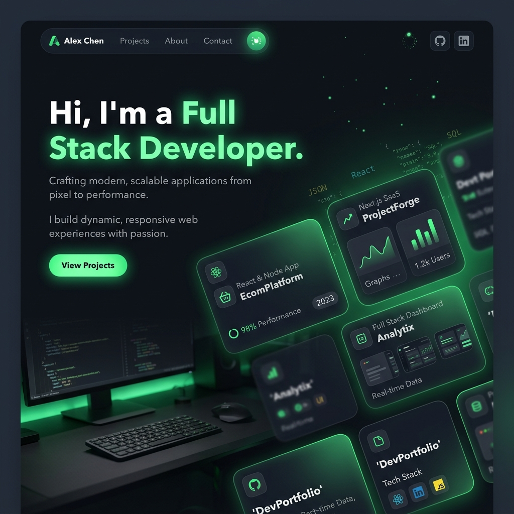

<div align="center">
  

  # ✨ Modern Developer Portfolio
  
  **A sleek, responsive, and highly interactive developer portfolio built with Next.js 15, React 19, and Tailwind CSS v4.**

  [](https://nextjs.org/)
  [](https://react.dev/)
  [](https://tailwindcss.com/)
  [](https://www.typescriptlang.org/)
</div>

<br />

## 🌐 Live Demo

The portfolio is live and hosted on **Netlify**:

**🔗 [https://stitch-mcp-project.netlify.app/](https://stitch-mcp-project.netlify.app/)**

## 🚀 Features

- **Dark Mode Design**: A premium, visually stunning aesthetic with tailored HSL colors.
- **Bento Grid Layout**: Dynamic, responsive bento boxes for the Ethos and Experience sections.
- **Micro-Animations**: Smooth hover effects and transitions that make the site feel alive.
- **Interactive Terminal**: A fun interactive terminal modal for a geeky touch.
- **SEO Optimized**: Fully semantic HTML and metadata setup.
- **App Router**: Leveraging the latest Next.js App Router for maximum performance.

## 🛠️ Getting Started

Follow these steps to run the portfolio on your local machine.

### 1. Installation

Clone the repository and install the dependencies. If you are on Windows, we highly recommend using `pnpm` to avoid filesystem locking issues:

```bash
# Using pnpm (Recommended)
npx pnpm install

# Alternatively
npm install
# or
yarn install
```

### 2. Run the Development Server

Start the Next.js development server:

```bash
# Using pnpm
npx pnpm dev

# Alternatively
npm run dev
# or
yarn dev
```

### 3. View the Site

Open [http://localhost:3000](http://localhost:3000) with your browser to see the result.

## 📁 Project Structure

- `app/`: Next.js App Router pages and global CSS.
- `components/`: Modular, reusable React components (Navbar, Hero, Bento boxes, etc).
- `data/`: Centralized data store (`portfolioData.ts`) where you can easily update your projects, skills, and experience without touching the UI code.
- `types/`: TypeScript definitions ensuring end-to-end type safety.
- `public/`: Static assets like images and icons.

## 🎨 Customization

To make this portfolio yours, simply edit the `data/portfolioData.ts` file! It acts as a lightweight CMS for your site. You can update your name, bio, social links, projects, and work experience all from one place.

## 📜 License

This project is licensed under the MIT License.
